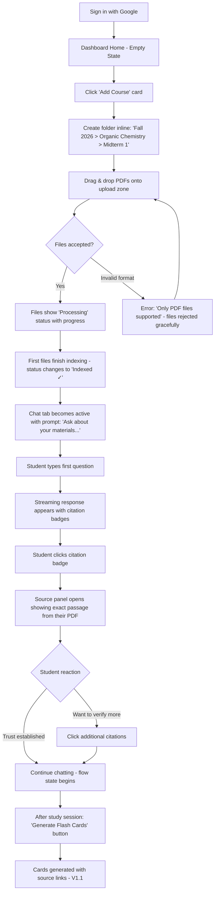
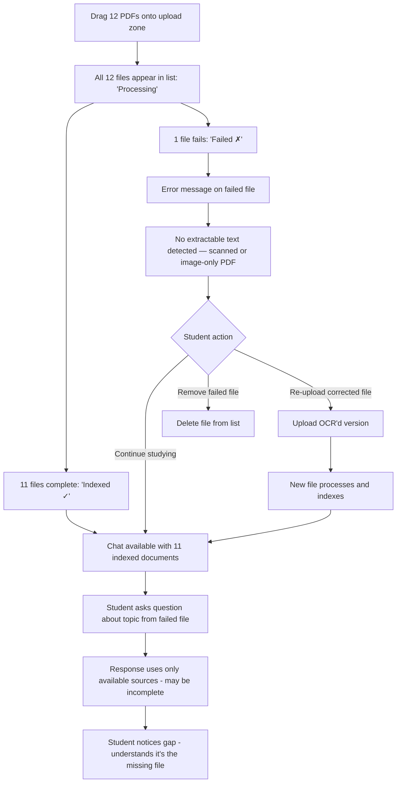
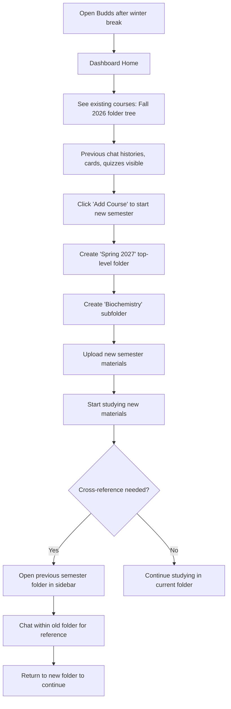
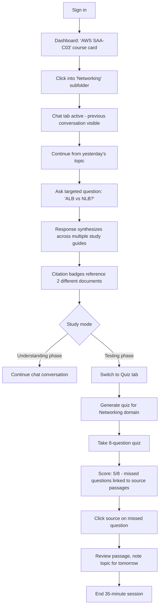
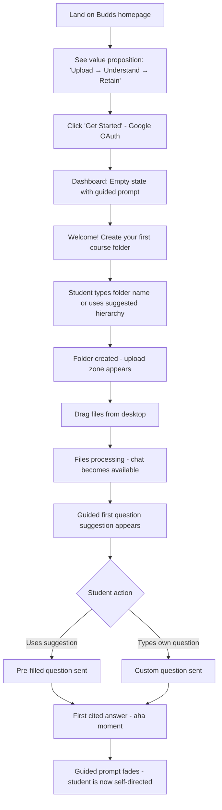

---
stepsCompleted:
  - 1
  - 2
  - 3
  - 4
  - 5
  - 6
  - 7
  - 8
  - 9
  - 10
  - 11
  - 12
  - 13
  - 14
lastStep: 14
status: complete
completedAt: "2026-04-09"
inputDocuments:
  - product-brief-budds.md
  - product-brief-budds-distillate.md
  - prd.md
  - project-context.md
  - docs/index.md
  - docs/project-overview.md
  - docs/architecture.md
  - docs/api-contracts.md
  - docs/data-models.md
  - docs/component-inventory.md
  - docs/development-guide.md
  - docs/source-tree-analysis.md
---

# UX Design Specification — Budds

**Author:** palmwine
**Date:** 2026-04-09

---

## Executive Summary

### Project Vision

Budds is a learning compiler that transforms raw course materials into structured learning outputs. Students upload documents, organize them hierarchically, and interact through AI-powered chat, quizzes, and flash cards — all grounded in their exact source material. The platform eliminates the fragmented workflow of switching between comprehension tools (NotebookLM) and retention tools (Quizlet/Anki) by unifying both capabilities around a single semantic search index.

### Target Users

**Primary — University Students:** Managing 3-5 courses per semester with accumulated lecture PDFs, study guides, and supplementary readings. Tech-comfortable but time-poor. Study in bursts between classes (mobile) and longer sessions at desks (desktop). Frustrated by the manual effort of converting understanding into study materials. Price-sensitive. Value trust and accuracy — they need to verify AI outputs against their professor's actual content.

**Secondary — Self-Directed Learners:** Professionals studying for certifications, researchers synthesizing literature. Study in shorter, focused daily sessions. Organize by domain rather than academic semester. Value cross-document synthesis and incremental progress tracking.

### Key Design Challenges

1. **Upload-to-value latency** — The 2-minute activation target requires the UI to feel productive even during async file ingestion. Students must be able to start chatting before all files finish processing.
2. **Information density without cognitive overload** — Chat responses with inline citations, a source panel, model selection, folder navigation, and file status indicators create a dense interface. The design must layer complexity progressively — simple by default, powerful on demand.
3. **Mobile study viability** — Flash card review and chat are primary mobile use cases. These can't be afterthoughts of a desktop layout — they need purpose-built mobile interactions.
4. **Trust mechanics in the UI** — Source citations are the core trust differentiator. The UX must make verifying AI outputs feel natural, not effortful — one tap from answer to the exact passage in the student's document.
5. **Multi-semester persistence** — The folder hierarchy must scale gracefully from one course to four years of education without becoming unwieldy.

### Design Opportunities

1. **Orchestrated "aha" moment** — The first upload-to-cited-answer experience is the conversion event. The UX should guide new users through this path with minimal friction and maximum impact.
2. **Seamless mode transitions** — Chat → quiz → flash cards should feel like one continuous learning session, not three separate features. Contextual prompts ("Generate cards from this topic?") can bridge understanding and retention naturally.
3. **Knowledge base as visual asset** — As the folder tree grows across semesters, visual indicators of coverage, study progress, and content depth can transform the archive from a file manager into a motivating personal knowledge map.
4. **Smart defaults that disappear** — Model selection, search parameters, and generation settings should have invisible smart defaults. Power users discover manual controls; everyone else just gets great results.

## Core User Experience

### Defining Experience

The core experience of Budds is the **question-to-cited-answer loop**: a student asks a question about their uploaded materials and receives an AI-generated answer with inline citations linking directly to the exact passages in their documents. This single interaction validates the product's value proposition — it proves the AI isn't hallucinating, it's reading the student's actual content. Every other feature (quizzes, flash cards, folder organization) exists to amplify this core loop.

The secondary experience is the **understand-to-retain transition**: after chatting to comprehend a topic, the student generates flash cards or a quiz from the same indexed content without leaving the interface or re-uploading anything. The RAG pipeline does double duty — comprehension and retention from one source of truth.

### Platform Strategy

| Context | Platform | Priority | Primary Use |
|---|---|---|---|
| Study sessions (30-90 min) | Desktop web | Primary | Upload, organize, chat, deep study |
| Between classes (5-15 min) | Mobile web | High | Flash card review, quick chat queries |
| On-the-go review | Mobile web | High | Quiz practice, card review |
| Lecture capture | Desktop web | Secondary | Upload during/after class |

**Rendering:** SSR for public pages (landing, login) for fast initial load and SEO. SPA-like navigation within the authenticated `/app/**` shell for responsive study sessions without full page reloads.

**Input modes:** Keyboard-first for desktop (chat input, folder management, navigation shortcuts). Touch-first for mobile (card swiping, tap-to-reveal, citation tap-through).

**No offline mode.** RAG queries require server-side AI services. The UI should degrade gracefully with clear offline messaging rather than attempting partial offline functionality.

### Effortless Interactions

1. **Upload-to-chat bridge** — Files begin processing on drop. The chat interface becomes available immediately. As documents finish indexing, they silently join the searchable corpus. The student doesn't wait for processing to complete before asking questions — they just start.

2. **Citation as first-class UI** — Source citations are not footnotes buried at the bottom. They appear inline with the response, visually distinct, and expand to show the exact passage on tap/click. One interaction from "AI said this" to "here's where it came from in your material."

3. **Invisible model intelligence** — The default model is selected for the best quality-to-cost ratio. No model picker is shown until the user actively seeks it. When they do, it's a simple dropdown — not a configuration panel.

4. **Contextual folder creation** — When uploading files, students can create new folders inline. No separate "manage folders" workflow required before uploading. The folder tree grows organically with the student's content.

5. **Study material generation from context** — After a chat session exploring a topic, a single action generates flash cards or a quiz from the documents in the current folder. No need to select files, configure parameters, or switch modes.

### Critical Success Moments

| Moment | What Happens | Why It Matters |
|---|---|---|
| First cited answer | Student sees their professor's words in a source citation | Establishes trust and "this is different" realization |
| First batch upload | 10+ files process successfully with clear status | Proves the tool can handle real course loads |
| First generated flash cards | Cards appear tied to specific passages, editable | Validates the "upload once, learn many ways" promise |
| Returning next semester | Previous courses intact, new folder created easily | Confirms the compounding knowledge base value |
| Failed file handling | Clear error message, partial success preserved | Builds confidence that the tool won't lose their work |

### Experience Principles

1. **Source truth over AI magic** — Every AI output must trace back to the student's materials. When the UX must choose between "impressive AI response" and "verifiably grounded response," choose grounded. Trust is the product.

2. **Progressive disclosure of power** — Simple by default, configurable on demand. Model selection, search tuning, and advanced options exist but don't clutter the primary flow. A first-time user and a power user see different levels of the same interface.

3. **Upload is the only setup** — Once files are in, everything else (chat, quizzes, cards) should require at most one additional click. No configuration wizards, no multi-step setup flows. Drop files → start learning.

4. **Study context persists** — Chat history, folder state, and generated materials survive across sessions, devices, and semesters. The student picks up exactly where they left off. Nothing is lost.

5. **Mobile is for consuming, desktop is for creating** — Upload and organize on desktop. Review and recall on mobile. Both must work for both, but the UX prioritizes each platform for its dominant use case.

## Desired Emotional Response

### Primary Emotional Goals

**Confident competence** — The dominant feeling Budds should evoke. Students arrive overwhelmed by material and leave feeling like they have a system working for them. The product transforms anxiety ("I have too much to study") into agency ("I have a tool that's already organized and understood my material").

**Earned trust** — Trust is not assumed; it's built interaction by interaction through source citations. Each verified citation strengthens the student's belief that this tool is reliable. By the fifth cited answer, skepticism is replaced by reliance.

**Effortless productivity** — The feeling that studying with Budds is faster and more effective than any alternative. Not through gamification or artificial urgency, but through genuine elimination of wasted steps.

### Emotional Journey Mapping

| Stage | Emotion | Design Implication |
|---|---|---|
| First visit (unauthenticated) | Curiosity, mild skepticism | Clear value prop, no jargon, instant credibility |
| First upload | Anticipation, slight anxiety | Immediate acknowledgment, visible progress, no ambiguity |
| First cited answer | Surprise, delight, trust | Source citation prominence, easy verification |
| Deep study session | Focused flow, growing confidence | Minimal UI chrome, conversational pacing, no distractions |
| Study material generation | Relief, satisfaction | One-click generation, instant preview, easy editing |
| Error or failure | Concern but not panic | Clear messaging, preserved progress, actionable next steps |
| Returning after absence | Comfort, continuity | Familiar state, intact materials, easy re-entry |
| Cross-semester growth | Pride, investment | Visible knowledge accumulation, growing folder tree |

### Micro-Emotions

**Confidence:** Clear affordances, obvious navigation, predictable behavior. The student never wonders "what do I do next?" or "did that work?"

**Trust:** Source citations as emotional anchors. The UI treats citations as proof, not decoration. Consistent citation quality builds cumulative trust that compounds over sessions.

**Accomplishment:** Concrete progress indicators — files indexed, cards generated, quiz scores earned. Small wins that validate the student's effort and the tool's contribution.

**Calm:** The visual and interaction design should feel steady and composed. No pulsing notifications, no countdown timers, no "you should be studying more" guilt mechanics. A study tool should be a calm workspace, not a source of additional stress.

### Design Implications

1. **Trust-building UI patterns** — Source citations must be visually prominent, immediately accessible, and consistently formatted. They are the primary trust mechanism and should receive premium visual treatment — not relegated to small text or collapsible panels.

2. **Progress celebration without gamification** — Show concrete accomplishments (files processed, cards created, topics covered) without leaderboards, streaks, or competitive mechanics. Students are already under enough pressure. Acknowledge progress quietly and clearly.

3. **Error states that reassure** — When something fails, the emotional priority is reassurance before resolution. "Your other 11 files are safe and searchable" comes before "This file failed because..." Preserve the student's sense of control.

4. **Calm visual design** — Muted color palette (zinc base already chosen), generous whitespace, smooth transitions. No jarring colors, no aggressive CTAs, no visual noise. The interface should feel like a well-organized desk, not a dashboard.

5. **Re-entry without friction** — When a student returns after days or weeks, the interface should feel immediately familiar. Same folder state, accessible chat history, no "what's new" modals blocking their path to studying.

### Emotional Design Principles

1. **Reduce anxiety, don't add it** — Every design decision should be evaluated against: "does this make the student feel more in control or less?" If a feature adds cognitive load without proportional value, remove it.

2. **Trust is earned in citations** — The source citation is the emotional core of the product. Invest disproportionate design effort in making citations feel authoritative, easy to access, and satisfying to verify.

3. **Show progress, not pressure** — Students know they need to study. Budds should show them what they've accomplished and what's available — never what they're behind on or haven't done.

4. **Consistency breeds confidence** — Predictable interactions, consistent component behavior, and stable layouts build the subconscious confidence that lets students focus on learning rather than navigating the tool.

## UX Pattern Analysis & Inspiration

### Inspiring Products Analysis

**NotebookLM** — Source-grounded AI chat pioneer. Their inline numbered citation format ([1], [2]) that expands to show the source passage on click is the established pattern students already understand. Their limitation — flat notebooks with no hierarchy and no study material outputs — is precisely the gap Budds fills. Adopt their citation UX pattern; improve everything around it.

**ChatGPT** — Established the conversational AI interface mental model. The sidebar-for-history + main-chat-pane layout is now a learned pattern across hundreds of millions of users. Streaming text with a visible cursor makes response generation feel immediate rather than delayed. Students will arrive at Budds expecting this interaction pattern — deviating from it would create unnecessary friction.

**Quizlet** — Defined flash card study UX for a generation. The card flip animation, swipe-to-advance gesture, and session progress indicator ("12/24 cards") are deeply embedded in student muscle memory. Budds' flash card review should feel immediately familiar to Quizlet users — the innovation is in how cards are generated (from RAG), not how they're studied.

**Linear** — Demonstrates that information-dense interfaces can feel clean and fast. Their sidebar tree navigation, keyboard shortcuts, and progressive disclosure of detail prove that hierarchy + density don't require visual clutter. Directly applicable to Budds' folder tree and document management.

**Notion** — Proven the nested sidebar tree pattern for content organization. Collapsible sections, drag-to-reorder, and inline creation (type to create a new page) are patterns students already use. Budds' folder tree should feel this natural.

### Transferable UX Patterns

**Navigation Patterns:**
- **Sidebar tree + main content pane** (Linear, Notion, ChatGPT) — Left sidebar for folder hierarchy and chat history; main pane for active content (chat, quiz, cards). Collapsible on mobile to maximize content area.
- **Breadcrumb navigation** (Notion, file managers) — Show current location in the folder hierarchy (Semester > Course > Topic) for spatial orientation.

**Interaction Patterns:**
- **Inline source citations** (NotebookLM) — Numbered references in chat responses that expand to show the exact source passage. One tap from claim to evidence.
- **Streaming text with cursor** (ChatGPT) — Token-by-token response rendering with a subtle blinking indicator. Transforms waiting into watching progress.
- **Card flip + swipe** (Quizlet) — Tap to reveal back of card, swipe to advance. The dominant learned pattern for flash card study.
- **Drag-and-drop upload** (Notion, Google Drive) — Drop zone that accepts files with immediate visual acknowledgment and background processing.
- **Inline creation** (Linear, Notion) — Create folders and organize content without leaving the current context. No modal workflows.

**Visual Patterns:**
- **Content-first density** (Linear) — Maximize content area, minimize chrome. Toolbars and controls are present but visually recessive until needed.
- **Muted palette with semantic accents** (Linear, Notion) — Neutral base (zinc) with color used sparingly for status, actions, and emphasis. Supports the "calm workspace" emotional goal.
- **Consistent card components** (Quizlet) — Reusable card patterns for flash cards, quiz questions, and source citations create visual coherence across features.

### Anti-Patterns to Avoid

1. **Quizlet's paywall friction** — Quizlet aggressively paywalls features students previously had for free, creating resentment. Budds should never gate core functionality behind surprise paywalls. If monetization comes later, the free tier must remain genuinely useful.

2. **NotebookLM's flat organization** — Their single-level notebook structure is their most-complained-about limitation. Budds must deliver on the hierarchy promise — but avoid over-engineering with unlimited nesting. Three levels is the right constraint.

3. **AI configuration overload** — Many AI tools expose temperature sliders, token limits, and system prompt editing to all users. This creates anxiety for non-technical students ("am I using the right settings?"). Hide all configuration behind smart defaults.

4. **Gamification guilt loops** — Duolingo-style streaks, leaderboards, and "you haven't studied today!" push notifications. Students are already under pressure. Study tools should reduce anxiety, not weaponize it.

5. **Feature discovery overload** — "What's new!" modals, feature tours, and tooltip tutorials that interrupt the user's intent. Students come to study, not to learn the tool. Features should be discoverable through natural use, not through interruptions.

6. **Cluttered chat interfaces** — Some AI tools pack model info, token counts, response timing, and action buttons on every message. This creates visual noise that competes with the actual content. Keep the chat clean; put metadata where power users can find it.

### Design Inspiration Strategy

**Adopt directly:**
- ChatGPT's sidebar + chat pane layout — it's the learned mental model
- NotebookLM's inline citation format — proven trust mechanism
- Quizlet's card flip/swipe study interaction — student muscle memory
- Streaming text rendering with visible progress indicator

**Adapt for Budds:**
- Linear's tree navigation — simplified for 3-level max depth, optimized for course/topic mental model rather than project management
- Notion's inline creation — adapted for folder + file upload context rather than page creation
- Quizlet's session progress — adapted to show source-linked progress rather than just card counts

**Avoid entirely:**
- Gamification mechanics (streaks, points, leaderboards)
- Configuration exposure (model settings, search parameters for default users)
- Paywall friction on core features
- Feature announcement interruptions
- Dense metadata displays in the primary UI

## Design System Foundation

### Design System Choice

**shadcn-nuxt (Reka UI) + Tailwind CSS 4** — A themeable headless component system that provides accessible, unstyled primitives styled through Tailwind utility classes. Components are added on-demand via CLI (`npx shadcn-vue@latest add <component>`), generating local source files that are fully customizable.

This system is already configured in the codebase (`components.json`) but has no scaffolded components yet — providing a clean slate with proven foundations.

### Rationale for Selection

1. **Already in the stack** — shadcn-nuxt, Reka UI, and Tailwind CSS 4 are configured and integrated. No migration cost, no new dependencies, no team learning curve beyond the existing toolchain.

2. **Headless accessibility** — Reka UI primitives provide WCAG-compliant keyboard navigation, focus management, and ARIA attributes out of the box. Critical for EdTech credibility and the NFR19 WCAG 2.1 AA requirement.

3. **Full visual control** — Unlike opinionated design systems (MUI, Ant Design), shadcn components are local source files styled with Tailwind classes. Every component can be customized to match Budds' specific visual identity without fighting framework defaults.

4. **On-demand component scaffolding** — Components are added individually as needed, keeping the bundle lean. No unused component library code shipped to students on slow campus WiFi.

5. **Dark/light mode native** — CSS variable theme tokens in oklch color space already support both modes. Theme switching requires no additional infrastructure.

6. **Solo developer velocity** — palmwine can scaffold a component in seconds and customize it in place. No design-dev handoff friction.

### Implementation Approach

**Component scaffolding strategy:**
- Scaffold components as needed during feature development — not all at once upfront
- Priority components for V1: Button, Input, Dialog, DropdownMenu, ScrollArea, Tooltip, Card, Separator, Badge, Sheet (mobile sidebar)
- Each scaffolded component lives in `app/components/ui/` with the `Ui` prefix

**Design token foundation:**
- Existing tokens in `app/assets/css/tailwind.css` define the full semantic color palette
- Tokens cover: background, foreground, primary, secondary, accent, destructive, muted, card, popover, border, input, ring, sidebar variants, chart colors, and border radius
- Both light and dark mode tokens are defined — extend as needed, don't replace

**Custom component strategy:**
- Build custom components for Budds-specific patterns not covered by shadcn primitives: message bubbles, source citation cards, folder tree nodes, flash card viewer, quiz question blocks, file upload zone, model selector
- Custom components follow the same pattern: Tailwind utility classes, `cn()` utility for class merging, composition API

### Customization Strategy

**Visual identity customization:**
- **Color:** Zinc base palette provides the calm, muted feel aligned with emotional design goals. Primary accent color to be defined for interactive elements (CTA buttons, active states, selected items).
- **Typography:** Inter font (400, 500, 600, 700) already configured. Establish a type scale: body text, headings, captions, code/monospace for source citations.
- **Spacing:** Leverage Tailwind's spacing scale consistently. Define component-specific spacing tokens if needed for density control.
- **Border radius:** `--radius` token already defined. Use consistently across all components for visual coherence.

**Component-level customization:**
- Override default shadcn styles to match Budds' visual language while preserving accessibility behavior from Reka UI primitives
- Use `cn()` utility (clsx + tailwind-merge) for conditional and composable class application
- No `<style>` blocks — all styling through Tailwind utility classes per project conventions

## Detailed Core Experience

### Defining Experience

**"Upload → Ask → See your source."**

The defining experience of Budds is the moment a student uploads course materials, asks a question in natural language, and receives an answer that quotes their professor's exact words with a clickable link back to the source passage. This is Budds' "swipe right" — the single interaction that, if executed perfectly, makes everything else in the product feel inevitable.

This experience is powerful because it collapses three separate actions students currently perform across multiple tools (upload to NotebookLM → understand → manually create cards in Quizlet) into one fluid sequence in one place. The source citation is what transforms a generic AI chat into a trusted study tool.

### User Mental Model

**Current mental model:** Students think in terms of "tools for understanding" and "tools for memorizing" as separate categories. NotebookLM is where you go to ask questions. Quizlet is where you go to study. The two don't talk to each other.

**Budds mental model shift:** "One place where my materials live and my learning happens." The folder tree is the student's mental model of their courses. Within each folder, all learning modes (chat, quiz, cards) are available from the same context. The shift is from tool-switching to mode-switching within a single workspace.

**Mental model anchors:**
- The folder tree maps to how students already organize coursework (by semester, course, topic)
- The chat interface maps to ChatGPT/NotebookLM — a pattern students use daily
- Flash cards map to Quizlet — a pattern students use weekly
- Source citations map to academic citation — a pattern students trust

**Potential confusion points:**
- Folder-scoped chat: students may expect to chat across all documents, not just within a folder. Clear scope indicators needed.
- Processing state: students may not understand why a just-uploaded file doesn't appear in chat results yet. Ingestion status must be visible.
- Model selection: students unfamiliar with LLM model differences may feel anxious about "choosing wrong." Smart defaults must eliminate this concern.

### Success Criteria

| Criteria | Metric | Why It Matters |
|---|---|---|
| Instant value perception | First cited answer within 2 minutes of first upload | The "aha" moment must happen before attention wanders |
| Citation trust | User clicks source citation on 30%+ of responses | Proves traceability is valued, not just present |
| Flow state entry | Average chat session exceeds 5 messages | Student entered a productive study flow, not a one-off query |
| Study material bridge | 40%+ of chatting users generate cards/quiz within 2 weeks (V1.1) | The understand-to-retain transition is working |
| Return behavior | 60% weekly return rate during active semester | The tool earned a place in the student's routine |

**"This just works" indicators:**
- Student uploads files and starts chatting without reading any instructions
- Source citations feel like a natural part of the response, not an add-on
- Folder creation happens as a natural part of the upload flow, not a prerequisite
- Model selection is invisible unless the student actively seeks it

### Novel UX Patterns

Budds combines established patterns in a novel configuration rather than inventing new interaction paradigms:

**Established patterns adopted:**
- AI chat with streaming responses (ChatGPT pattern — students use this daily)
- Sidebar navigation with tree hierarchy (Notion/Linear pattern — widely understood)
- Flash card flip and review (Quizlet pattern — ingrained in student behavior)
- Drag-and-drop file upload (universal web pattern)

**Novel combination — the "learning compiler" pattern:**
- Chat and study material generation share the same RAG context. This is architecturally novel but should feel obvious to the user. The novelty is invisible — the student just sees that "asking questions" and "making flash cards" work from the same uploaded files without any extra configuration.
- Source citations bridge chat and study materials. A citation in a chat response and a source link on a flash card use the same UI pattern, creating visual continuity across modes.

**No user education needed:**
- Every individual interaction pattern is already familiar to the target audience
- The innovation is in the combination and the elimination of manual bridging — students don't need to learn anything new, they just stop doing the tedious parts

### Experience Mechanics

**1. Initiation — Upload & Organize**

| Step | User Action | System Response |
|---|---|---|
| Arrive | Student signs in with Google | Redirect to workspace (folder tree + empty state) |
| First upload | Drag files onto drop zone or click to browse | Immediate file acknowledgment, progress indicators appear |
| Organize | Create folder inline or select existing folder | Files associate with folder, ingestion begins in background |
| Ready | Files show "indexed" status | Chat input becomes contextually active for that folder |

**2. Interaction — Question-to-Cited-Answer**

| Step | User Action | System Response |
|---|---|---|
| Ask | Type natural language question in chat input | Input clears, user message appears in chat thread |
| Wait | Watch streaming response appear | Tokens render progressively with subtle cursor, sources load alongside |
| Read | Scan AI response with inline citation markers | Citations appear as numbered badges ([1], [2]) inline with text |
| Verify | Tap/click citation badge | Source passage expands inline or in side panel with document name and passage highlight |
| Continue | Ask follow-up question or take next action | Chat thread maintains context, model remembers conversation |

**3. Feedback — Trust & Progress Signals**

| Signal | What It Communicates |
|---|---|
| Streaming text | "I'm working on your answer right now" |
| Citation badges | "This answer is grounded in your material" |
| Source passage highlight | "Here's exactly where this came from" |
| File status indicators | "Your documents are being processed / ready / had an issue" |
| Folder content count | "You have X documents in this folder" |

**4. Completion — From Understanding to Retention**

| Step | User Action | System Response |
|---|---|---|
| Feel confident | Student understands the topic from chat | Contextual suggestion appears: "Generate flash cards from this topic?" |
| Generate | Click to generate study materials | Cards/quiz generated from the same indexed content, source-linked |
| Review | Flip through cards or take quiz | Progress tracked, sources accessible on each card/question |
| Return | Come back later to review or study more | Chat history intact, materials saved, folder state preserved |

## Visual Design Foundation

### Color System

**Base palette: Zinc (oklch color space)**

The existing color system uses a neutral zinc palette in oklch color space — perceptually uniform, ensuring consistent contrast ratios across light and dark modes. This aligns with the "calm workspace" emotional design goal.

**Semantic color mapping (already defined):**

| Token | Light Mode | Dark Mode | Usage |
|---|---|---|---|
| `--background` | White | Near-black zinc | Page background |
| `--foreground` | Near-black zinc | Near-white | Primary text |
| `--primary` | Dark zinc | Light zinc | Primary actions, selected states |
| `--secondary` | Light zinc | Dark zinc | Secondary surfaces, subtle backgrounds |
| `--muted` | Light zinc | Dark zinc | Subdued backgrounds, disabled states |
| `--muted-foreground` | Mid zinc | Mid zinc | Secondary text, placeholders |
| `--accent` | Light zinc | Dark zinc | Hover states, subtle emphasis |
| `--destructive` | Red-orange | Lighter red-orange | Delete actions, error states |
| `--border` | Light zinc | White at 10% opacity | Dividers, component borders |
| `--card` | White | Dark zinc | Elevated surfaces (cards, panels) |
| `--sidebar-*` | Dedicated sidebar palette | Dedicated sidebar palette | Folder tree, navigation |

**Recommended additions for Budds-specific needs:**

| Purpose | Recommendation | Rationale |
|---|---|---|
| Citation badge | Subtle blue or teal accent | Visually distinct from body text, evokes "reference/link" |
| Success state | Muted green | File indexed, quiz passed, upload complete |
| Warning state | Muted amber | Processing, partial success |
| Source highlight | Low-opacity primary tint | Background color for highlighted source passages |

**Dark mode is the default** — aligns with student preference for late-night study sessions and reduced eye strain. Light mode is fully supported for daytime use.

### Typography System

**Primary typeface: Inter**

| Weight | Usage |
|---|---|
| 400 (Regular) | Body text, chat messages, card content |
| 500 (Medium) | Labels, navigation items, metadata |
| 600 (Semibold) | Subheadings, folder names, active states |
| 700 (Bold) | Page headings, empty state titles |

**Type scale:**

| Element | Size | Weight | Line Height | Usage |
|---|---|---|---|---|
| Page heading | 1.5rem (24px) | 700 | 1.33 | Page titles, empty state headings |
| Section heading | 1.125rem (18px) | 600 | 1.44 | Section dividers, panel titles |
| Body | 0.875rem (14px) | 400 | 1.57 | Chat messages, card content, document text |
| Body emphasis | 0.875rem (14px) | 500 | 1.57 | Folder names, file names, labels |
| Caption | 0.75rem (12px) | 400 | 1.5 | Timestamps, metadata, file sizes, citation references |
| Code/Source | 0.8125rem (13px) | 400 (mono) | 1.54 | Source citation passages, code snippets |

**Typography principles:**
- 14px base body size — dense enough for information-rich interfaces, readable for extended study sessions
- Monospace font for source citation passages to visually distinguish "your material" from "AI-generated text"
- No decorative fonts — Inter's neutrality supports the "calm workspace" emotional goal
- Consistent line heights across the interface for visual rhythm

### Spacing & Layout Foundation

**Spacing scale:** Tailwind's default 4px base unit (1 = 4px, 2 = 8px, 3 = 12px, 4 = 16px, etc.)

**Layout architecture:**

```
┌─────────────────────────────────────────────────────┐
│ Header (if needed)                            h-12  │
├──────────┬──────────────────────────────────────────┤
│ Sidebar  │ Main Content Area                        │
│ w-64     │                                          │
│          │ ┌──────────────────┐ ┌─────────────────┐ │
│ Folder   │ │ Primary Panel    │ │ Source Panel     │ │
│ Tree     │ │ (Chat/Quiz/Cards)│ │ (Citations)      │ │
│          │ │                  │ │ Collapsible      │ │
│ Chat     │ │                  │ │                  │ │
│ History  │ │                  │ │                  │ │
│          │ └──────────────────┘ └─────────────────┘ │
├──────────┴──────────────────────────────────────────┤
│ Input Area (chat input, fixed bottom)         h-16  │
└─────────────────────────────────────────────────────┘
```

**Component spacing standards:**

| Context | Spacing | Tailwind Class |
|---|---|---|
| Between sections | 24px | `gap-6` |
| Between related items | 12px | `gap-3` |
| Inside cards/panels | 16px | `p-4` |
| Between list items | 8px | `gap-2` |
| Inline element spacing | 8px | `gap-2` |
| Chat message spacing | 16px | `gap-4` |
| Sidebar item padding | 8px vertical, 12px horizontal | `py-2 px-3` |

**Layout principles:**
1. **Content-first density** — Maximize the chat/content area. Sidebar and source panel are functional but don't compete for attention.
2. **Sidebar collapses on mobile** — Full-width content area on small screens, sidebar accessible via Sheet (slide-in overlay).
3. **Source panel is contextual** — Appears when citations are available, collapses when not relevant. Not a permanent fixture.
4. **Fixed input area** — Chat input stays at the bottom of the viewport, always accessible during scrolling through conversation history.

**Border radius:** `--radius: 0.625rem` (10px) — Soft, rounded corners that feel modern and approachable without being overly playful. Applied consistently via `--radius-sm` (6px), `--radius-md` (8px), `--radius-lg` (10px), `--radius-xl` (14px).

### Accessibility Considerations

**Color contrast (WCAG 2.1 AA):**
- All text meets 4.5:1 minimum contrast ratio against its background in both light and dark modes
- The oklch color space enables perceptually uniform contrast calculations — more reliable than hex/rgb for meeting WCAG targets
- Interactive elements (links, buttons, citations) must maintain 3:1 contrast against surrounding content
- Focus indicators use `--ring` token — visible in both modes

**Keyboard navigation:**
- All interactive elements reachable via Tab key
- Reka UI primitives provide built-in focus management, arrow key navigation in lists/menus, and Escape to close overlays
- Custom focus indicator styles must be visible (not just browser default outlines)
- Chat input focusable with a keyboard shortcut (e.g., `/` to focus, common in chat interfaces)

**Screen reader support:**
- Chat messages include role context (user vs. assistant)
- Source citations include descriptive labels ("Source from [filename], passage [n]")
- File upload status communicated via ARIA live regions
- Folder tree uses `role="tree"` and `role="treeitem"` with appropriate `aria-expanded` states

**Motion sensitivity:**
- Respect `prefers-reduced-motion` media query
- Streaming text animation degrades to instant rendering for motion-sensitive users
- Card flip animations degrade to simple show/hide transitions
- All tw-animate-css animations are suppressible

## Design Direction Decision

### Design Directions Explored

Six distinct design directions were generated and evaluated, ranging from the familiar three-panel layout (D1) to immersive full-width chat (D3) to a split-view study mode (D6). Each explored a different trade-off between information density, feature discoverability, and conversational immersion. Interactive HTML mockups are available at `_bmad-output/planning-artifacts/ux-design-directions.html`.

| Direction | Layout | Strength | Weakness |
|---|---|---|---|
| D1: Classic Three-Panel | Sidebar + Chat + Source Panel | Familiar, sources always visible | Three columns tight on small screens |
| D2: Inline Citations | Sidebar + Wide Chat | Maximum chat width | Can't compare sources across messages |
| D3: Full-Width Chat | No sidebar, folder pills | Most immersive, best mobile parity | Folder navigation requires extra step |
| D4: Study Mode Tabs | Sidebar + Tabbed modes | Clear mode separation, discoverable | Can't see chat + cards simultaneously |
| D5: Dashboard Home | Card-based course overview | Great for returning users | Extra click to start studying |
| D6: Split View | Chat + Study side-by-side | Seamless understand-to-retain | Desktop-only, complex layout |

### Chosen Direction

**Hybrid approach combining four directions:**

1. **D4 (Study Mode Tabs)** as the primary application structure — Chat, Flash Cards, Quiz, and Documents as tabs within each folder context. Makes all study modes immediately discoverable and provides clear wayfinding.

2. **D1 (Source Panel)** within the Chat tab — A collapsible right panel showing source citations with full passage previews. Provides the trust-building citation verification experience without cluttering the chat.

3. **D5 (Dashboard Home)** as the entry/home view — Card-based overview showing all courses, document counts, and recent activity. Gives returning students a welcoming entry point and reinforces the "growing knowledge base" emotional goal.

4. **D3 (Full-Width)** as the mobile layout — Sidebar collapses to a Sheet overlay, source panel becomes inline citations, tabs stack horizontally with scroll. The mobile experience prioritizes chat and card review.

### Design Rationale

1. **Tabs make the "learning compiler" visible** — New users immediately see that Budds offers Chat, Cards, Quiz, and Documents — they don't need to discover these features through menus or contextual suggestions. The value proposition is visible in the tab bar.

2. **Source panel preserves trust mechanics** — A dedicated panel for source passages (collapsible when not needed) lets students verify multiple citations without losing their place in the conversation. This is the core differentiator and deserves dedicated screen real estate on desktop.

3. **Dashboard validates the compounding asset** — Showing courses, document counts, and recent activity on the home view reinforces that Budds is a growing knowledge base, not a disposable tool. Each return visit, the student sees their investment accumulating.

4. **Mobile-first doesn't mean mobile-only** — The full-width mobile layout ensures students can study between classes. But desktop gets the premium multi-panel experience because that's where deep study sessions happen.

### Implementation Approach

**Desktop layout (>1024px):**

```
┌──────────────────────────────────────────────────────┐
│ Breadcrumb: Fall 2026 > Organic Chemistry > Midterm 1│
├──────────┬───────────────────────────────────────────┤
│ Sidebar  │ [💬 Chat] [⚡ Cards] [📝 Quiz] [📄 Docs] │
│ w-64     ├───────────────────────┬───────────────────┤
│          │ Chat Area             │ Source Panel       │
│ Folders  │                       │ (collapsible)      │
│ + Chats  │                       │ w-72               │
│          │                       │                    │
│          ├───────────────────────┴───────────────────┤
│          │ Chat Input (fixed bottom)                  │
├──────────┴───────────────────────────────────────────┤
```

**Tablet layout (768-1024px):** Source panel collapses to inline citations. Sidebar remains.

**Mobile layout (<768px):** Sidebar becomes Sheet overlay. Full-width single column. Tabs scroll horizontally. Source citations inline as expandable chips.

**Home/Dashboard view:** Shown at `/app` before navigating into a folder. Card grid of courses with quick actions. Recent activity feed. "Add Course" card for new folder creation.

## User Journey Flows

### Journey 1: First-Time Upload & Chat (Priya Success Path)

**Goal:** Student uploads course materials and gets their first source-cited answer within 2 minutes.



**Key interaction details:**

| Step | Duration | Feedback |
|---|---|---|
| File drop to acknowledgment | < 1 second | Files appear in list with spinner |
| Processing per PDF | < 60 seconds | Progress indicator per file |
| First file indexed | 10-30 seconds | Status badge changes, subtle notification |
| Question to first token | < 1 second | Streaming text begins |
| Full response | < 5 seconds | Citations appear alongside text |
| Citation click to passage | Instant | Source panel slides open |

### Journey 2: Failed Upload Recovery (Priya Edge Case)

**Goal:** Student uploads a batch with one failing file; system preserves partial success and provides actionable feedback.



**Error state design:**

| State | Visual Treatment | Message |
|---|---|---|
| Processing | Amber spinner + "Processing..." | File name visible, progress indicator |
| Success | Green checkmark + "Indexed" | File name, document count updates |
| Failed | Red X + "Failed" | Specific error reason, actionable guidance |
| Batch summary | "11/12 files indexed" | Reassuring partial success messaging |

### Journey 3: Returning Student — Cross-Semester (Priya Returning)

**Goal:** Student returns for a new semester, finds previous materials intact, and creates a new workspace.



### Journey 4: Self-Directed Learner — Certification Prep (David)

**Goal:** Professional studies for AWS certification using daily 30-45 minute focused sessions.



### Journey 5: Document Management — Organize & Upload (New User Onboarding)

**Goal:** Brand new user goes from zero to organized knowledge base.



**Empty state design:**

| State | Content | Action |
|---|---|---|
| No folders | "Start by creating a course folder" | Inline folder name input + create button |
| Folder created, no files | Upload zone with "Drag PDFs here or browse" | Drag-and-drop zone + file picker |
| Files processing | "Your materials are being indexed..." with file status list | Chat input visible but subtly indicating "more sources loading" |
| First file indexed | "Ready! Ask your first question" with optional suggested question | Chat input focused, suggestion chip visible |

### Journey Patterns

**Common patterns across all journeys:**

1. **Progressive availability** — Features become active as prerequisites are met. Chat activates when files are indexed. Quiz/cards activate when documents exist in the folder. No disabled buttons with tooltips — features simply appear when ready.

2. **Contextual scope indicators** — Every view shows the current folder scope. Breadcrumbs in the header, folder name in the chat input placeholder ("Ask about your Organic Chemistry materials..."), and document count badge all reinforce what context the AI is searching.

3. **Non-blocking async** — File processing never blocks the student from starting work. Upload happens in background. Chat becomes available as files index, not after all files finish. Partial availability is the norm, not the exception.

4. **Source-first error recovery** — When something fails, show what succeeded first ("11/12 files indexed"), then explain the failure with a specific, actionable reason. Never show just an error without context of what's still working.

5. **Session continuity** — Every return visit picks up where the student left off. Chat history visible, folder state preserved, quiz scores retained. No re-orientation needed. The sidebar shows recent chats as entry points.

### Flow Optimization Principles

1. **Minimize steps to first value** — The path from "new user" to "first cited answer" must be: Sign in → Create folder → Upload → Ask. Four actions, under 2 minutes. No tutorials, no settings, no configuration.

2. **Remove decision anxiety** — Smart defaults for model selection, search parameters, and quiz format eliminate "am I doing this right?" moments. The student makes one meaningful decision (what to ask), not twelve configuration decisions.

3. **Make progress visible** — File processing status, chat message counts, quiz scores, and card completion all provide concrete evidence of progress. The student never wonders "is this working?"

4. **Design for interruption** — Students study in fragmented time. Every state persists. Closing the browser mid-conversation loses nothing. Returning mid-quiz resumes where they stopped. The tool adapts to the student's schedule, not the other way around.

5. **Error messages as guidance** — "No extractable text detected — this may be a scanned PDF. Try running it through an OCR tool and re-uploading." Errors tell the student what happened AND what to do about it.

## Component Strategy

### Design System Components

**shadcn-nuxt components to scaffold (via `npx shadcn-vue@latest add`):**

| Component | Usage in Budds | Priority |
|---|---|---|
| Button | All CTAs, actions (send, generate, upload) | V1 |
| Input | Chat input, folder name input, search | V1 |
| Card | Dashboard course cards, source citation cards | V1 |
| Dialog | Confirmations (delete folder, delete account) | V1 |
| DropdownMenu | Model selector, folder context menu | V1 |
| ScrollArea | Chat message list, sidebar, source panel | V1 |
| Tooltip | Icon button labels, status explanations | V1 |
| Sheet | Mobile sidebar overlay | V1 |
| Separator | Section dividers in sidebar and panels | V1 |
| Badge | File count badges, status indicators | V1 |
| Tabs | Study mode tabs (Chat, Cards, Quiz, Documents) | V1 |
| Progress | File upload/processing progress | V1 |
| Alert | Error messages, system notifications | V1 |
| Skeleton | Loading states for chat, file lists | V1 |
| Collapsible | Folder tree expand/collapse | V1 |
| Toggle | Dark/light mode switch | V1 |

### Custom Components

**1. ChatMessage**

| Attribute | Detail |
|---|---|
| Purpose | Renders a single chat message with role-based styling and inline citation badges |
| Props | `role: 'user' \| 'assistant'`, `content: string`, `sources?: Source[]`, `model?: string`, `timestamp?: Date` |
| States | Default, streaming (animated cursor), error (retry action) |
| Variants | User message (muted background, right-aligned), Assistant message (bordered, left-aligned with citations) |
| Accessibility | `role="log"` on container, `aria-label` with role context per message |

**2. CitationBadge**

| Attribute | Detail |
|---|---|
| Purpose | Inline numbered reference that links to a source passage |
| Props | `index: number`, `source: Source`, `variant?: 'blue' \| 'teal'` |
| States | Default, hover (darker background), active/expanded |
| Interaction | Click opens/scrolls source panel to matching passage. Hover shows tooltip preview. |
| Accessibility | `role="button"`, `aria-label="Source [n] from [filename]"`, keyboard focusable |

**3. SourceCard**

| Attribute | Detail |
|---|---|
| Purpose | Displays a source passage in the source panel with document metadata |
| Props | `index: number`, `filename: string`, `content: string`, `score: number` |
| States | Default, highlighted (when corresponding citation badge is hovered/clicked) |
| Content | Citation number, filename, relevance score badge, passage text in monospace |
| Accessibility | `aria-label="Source passage from [filename]"`, scrollable into view when activated |

**4. FolderTree**

| Attribute | Detail |
|---|---|
| Purpose | Navigable hierarchical folder structure in the sidebar (max 3 levels) |
| Props | `folders: Folder[]`, `activeFolder?: string` |
| States | Collapsed, expanded, active (selected), empty |
| Interaction | Click to expand/collapse. Click leaf to navigate. Right-click for context menu. Drag files onto folders. |
| Accessibility | `role="tree"`, `role="treeitem"`, `aria-expanded`, arrow key navigation |

**5. FileUploadZone**

| Attribute | Detail |
|---|---|
| Purpose | Drag-and-drop area for uploading PDFs to a folder |
| Props | `folderId: string`, `accept?: string[]` |
| States | Default (dashed border), drag-over (highlighted), uploading (progress), success, error |
| Interaction | Drag files onto zone or click to open file picker. Multiple files supported. |
| Accessibility | `role="button"`, `aria-label="Upload files"`, keyboard activatable |

**6. FileStatusItem**

| Attribute | Detail |
|---|---|
| Purpose | Displays a single uploaded file with its processing status |
| Props | `filename: string`, `status: 'processing' \| 'indexed' \| 'failed'`, `error?: string`, `size?: number` |
| States | Processing (amber spinner), indexed (green check), failed (red X with error message) |
| Actions | Delete file, retry upload (on failure) |
| Accessibility | ARIA live region for status changes, descriptive labels |

**7. FlashCard**

| Attribute | Detail |
|---|---|
| Purpose | Displays a study flash card with flip animation and source link (V1.1) |
| Props | `front: string`, `back: string`, `source?: Source`, `index: number`, `total: number` |
| States | Front-facing (question), back-facing (answer), editing |
| Interaction | Click/tap to flip. Swipe to advance (mobile). Edit button to modify content. |
| Accessibility | `aria-label` with card content, reduced motion degrades to instant flip |

**8. QuizQuestion**

| Attribute | Detail |
|---|---|
| Purpose | Renders a quiz question with answer options and source citation (V1.1) |
| Props | `question: string`, `options?: string[]`, `type: 'multiple-choice' \| 'free-response'`, `source?: Source` |
| States | Unanswered, answered, correct (green), incorrect (red with source link) |
| Interaction | Click option to select (MC), type answer (free response), submit to check |
| Accessibility | `role="radiogroup"` for MC, `aria-label` per option, keyboard selectable |

**9. ModelSelector**

| Attribute | Detail |
|---|---|
| Purpose | Dropdown for selecting the AI model (hidden by default, discoverable by power users) |
| Props | `models: Model[]`, `selected: string`, `recommended: string` |
| States | Hidden (shows only recommended model label), expanded (full dropdown) |
| Interaction | Click model label in chat footer to open dropdown. Shows "(recommended)" badge on default. |
| Accessibility | Standard dropdown semantics, keyboard navigable |

**10. DashboardCourseCard**

| Attribute | Detail |
|---|---|
| Purpose | Card on the home dashboard representing a course/folder with quick actions |
| Props | `folder: Folder`, `documentCount: number`, `lastStudied?: Date` |
| States | Default, hover (elevated), empty (dashed "Add Course" variant) |
| Actions | Click to navigate into folder. Quick action buttons: Chat, Cards. |
| Content | Course name/emoji, document count, last activity timestamp |

### Component Implementation Strategy

**Build order principle:** Components are built as needed by the feature being developed, not scaffolded all at once.

**Pattern consistency:**
- All custom components use Tailwind utility classes via `cn()` helper
- All custom components accept a `class` prop for external styling override
- All interactive components support keyboard navigation
- Budds-specific components use descriptive names without prefix: `ChatMessage`, `FolderTree`, `FlashCard`

**Composition over configuration:**
- Prefer composing shadcn primitives inside custom components over building from scratch
- Example: `ModelSelector` composes `UiDropdownMenu` + `UiButton`
- Example: `FileStatusItem` composes `UiBadge` + `UiButton` + `UiTooltip`

### Implementation Roadmap

**Phase 1 — V1 Core (Upload, Organize, Chat):**

| Priority | Component | Needed For |
|---|---|---|
| 1 | FolderTree | Sidebar navigation — all journeys depend on this |
| 2 | FileUploadZone + FileStatusItem | Upload journey — the entry point to value |
| 3 | ChatMessage + CitationBadge | Chat experience — the core differentiator |
| 4 | SourceCard | Trust mechanics — citation verification |
| 5 | DashboardCourseCard | Home view — entry point for returning users |
| 6 | ModelSelector | Power user feature — low priority but needed for V1 |

**Phase 2 — V1.1 Active Learning:**

| Priority | Component | Needed For |
|---|---|---|
| 7 | FlashCard | Card study mode |
| 8 | QuizQuestion | Quiz mode |

**Scaffolding sequence:** Scaffold shadcn primitives as needed by custom components. Button and Input first (used everywhere), then Card and Tabs (dashboard + study modes), then Dialog and DropdownMenu (folder management), then Sheet (mobile).

## UX Consistency Patterns

### Button Hierarchy

| Level | Style | Usage | Example |
|---|---|---|---|
| Primary | Solid `bg-primary text-primary-foreground` | One per view — the main action | "Send" in chat input, "Generate Cards" |
| Secondary | Outlined `border bg-muted` | Supporting actions | "New Chat", "Upload Files" |
| Ghost | No border, text only with hover bg | Tertiary/contextual actions | Sidebar items, tab items, icon buttons |
| Destructive | `bg-destructive` or red text | Irreversible actions (always with confirmation) | "Delete Folder", "Delete Account" |

**Button rules:**
- Maximum one primary button visible per context area
- Destructive actions always require a Dialog confirmation with explicit action label ("Delete 18 documents and all chat history" — not just "Delete")
- Icon-only buttons always have a Tooltip label
- Send button in chat uses primary style; all other chat-area buttons use ghost

### Feedback Patterns

**Toast/notification patterns (not used):** Budds avoids toast notifications. Status changes are shown inline where the action happened.

**Inline feedback:**

| Type | Visual | Duration | Example |
|---|---|---|---|
| Success | Green checkmark + brief text | Persistent until context changes | "Indexed ✓" on file status |
| Processing | Amber spinner + text | Until complete | "Processing..." on file upload |
| Error | Red icon + specific message + action | Persistent until resolved or dismissed | "Failed — No extractable text. [Remove]" |
| Info | Muted text, no icon | Persistent | "Searching 18 documents" in chat footer |

**Streaming feedback:** Chat responses use streaming text with a subtle blinking cursor. This is the primary "working" indicator — no separate loading spinner needed for chat.

**Empty states:** Every empty container has a contextual message with a single clear action:

| Context | Message | Action |
|---|---|---|
| No folders | "Start by creating a course folder" | Inline text input + create button |
| Folder with no files | "Drag PDFs here to get started" | Upload drop zone |
| No chat history | "Ask a question about your materials" | Focused chat input |
| No flash cards | "Generate flash cards from your documents" | Generate button |
| No quiz results | "Create a quiz to test your knowledge" | Generate button |

### Form Patterns

**Input behavior:**
- Chat input: Single-line with Enter to send, Shift+Enter for newline. Auto-grows to max 4 lines.
- Folder name input: Inline editing — click folder name to rename, Enter to confirm, Escape to cancel
- No form-heavy flows — authentication is handled by Google OAuth (one button)

**Validation:**
- File upload: Client-side validation for file type (PDF only) and size before upload begins
- Folder names: Prevent empty names, trim whitespace, max 100 characters
- Chat input: Prevent empty submissions. No character limit.

### Navigation Patterns

**Sidebar navigation:**
- Always visible on desktop (>1024px), collapsible via Sheet on mobile
- Two sections: Folders (tree hierarchy) and Recent Chats (flat list)
- Active item highlighted with `bg-muted` background
- Folder tree expands/collapses on click. Only one branch expanded at a time.

**Breadcrumb navigation:**
- Always visible in the main header area
- Shows full path: `Semester > Course > Topic`
- Each segment clickable to navigate up the hierarchy
- On mobile: truncated to current folder name with back arrow

**Tab navigation (study modes):**
- Horizontal tabs below breadcrumb: Chat | Flash Cards | Quiz | Documents
- Active tab has bottom border accent
- On mobile: tabs scroll horizontally if they overflow

**Page transitions:**
- SPA-like navigation within `/app/**` — no full page reloads
- All transitions under 300ms

### Loading Patterns

| Context | Pattern | Visual |
|---|---|---|
| Initial page load | Skeleton components matching layout | Gray animated placeholder blocks |
| Chat response | Streaming text with cursor | Real-time text rendering |
| File processing | Per-file progress indicator | Spinner + "Processing..." status |
| Card/quiz generation | Full-area skeleton | Placeholder cards with shimmer |
| Folder tree loading | Skeleton tree items | Gray bars matching tree layout |
| Source panel loading | Skeleton cards | Placeholder source cards |

**Loading rules:**
- Never show a blank screen — always use skeleton placeholders matching expected layout
- Streaming text is the preferred loading pattern for AI outputs
- File processing shows individual file status, not a single batch progress bar

### Modal & Overlay Patterns

**Dialog usage (sparingly):**
- Destructive confirmations only: delete folder (with cascade warning), delete account, delete chat history
- Never for routine actions

**Sheet usage (mobile sidebar):**
- Slide-in from left for folder navigation on mobile
- Closes on outside tap or explicit close button
- Preserves scroll position when reopened

**No tooltips as primary information:** Tooltips supplement, never replace, visible labels.

### Keyboard Shortcuts

| Shortcut | Action | Context |
|---|---|---|
| `/` | Focus chat input | Anywhere in app |
| `Escape` | Close panel / Sheet / cancel editing | Contextual |
| `Enter` | Send message | Chat input focused |
| `Shift+Enter` | New line in message | Chat input focused |
| `Ctrl/Cmd+N` | New chat | Anywhere in app |
| Arrow keys | Navigate folder tree / flash cards | Sidebar / card review |
| `Space` | Flip flash card | Card review mode |

### Micro-Interaction Patterns

**Hover states:** Subtle `bg-muted` background on interactive elements. No scaling, no shadow changes.

**Active/selected states:** `bg-muted` background with `text-foreground`. Active tab adds bottom border accent.

**Transitions:** All transitions 150ms ease. No bouncing, no spring physics. Smooth and quick.

**Drag-and-drop:** Upload zone border changes from dashed to solid on drag-over. Subtle background tint. Files snap into file list on drop.

## Responsive Design & Accessibility

### Responsive Strategy

**Approach: Desktop-optimized, mobile-capable.** Desktop is where students do deep study sessions (upload, organize, chat for 30-90 minutes). Mobile is where they do quick review (flash cards between classes, quick chat queries for 5-15 minutes). Both must work well, but the UX is optimized for each platform's dominant use case.

**Desktop (>1024px):**
- Full three-panel layout: sidebar (w-64) + main content + collapsible source panel (w-72)
- Study mode tabs visible in main area
- Keyboard shortcuts active
- Drag-and-drop file upload
- Multi-column dashboard with course cards

**Tablet (768-1024px):**
- Two-panel layout: sidebar + main content
- Source panel collapses — citations become inline expandable chips
- Touch-optimized tap targets (min 44x44px)
- Folder tree remains in sidebar
- Dashboard cards in 2-column grid

**Mobile (<768px):**
- Single-column layout — full-width content
- Sidebar becomes Sheet overlay (slide-in from left)
- Study mode tabs scroll horizontally
- Source citations inline as expandable chips below messages
- Chat input fixed at bottom with full-width send button
- Flash card review optimized for vertical swipe
- Dashboard cards stack in single column
- Breadcrumb truncated to current folder + back arrow

### Breakpoint Strategy

| Breakpoint | Tailwind Class | Layout Changes |
|---|---|---|
| < 640px (sm) | Default (mobile-first) | Single column, Sheet sidebar, stacked cards |
| 640px (sm) | `sm:` | Minor spacing adjustments |
| 768px (md) | `md:` | Two-column layout, sidebar visible, 2-col dashboard grid |
| 1024px (lg) | `lg:` | Three-column layout, source panel available |
| 1280px (xl) | `xl:` | Wider content areas, 3-col dashboard grid |

**Mobile-first CSS approach:** Base styles target mobile. `md:` and `lg:` prefixes add desktop enhancements.

**Component-level responsive behavior:**

| Component | Mobile | Tablet | Desktop |
|---|---|---|---|
| Sidebar | Sheet overlay | Persistent, narrow | Persistent, w-64 |
| Source panel | Inline citations | Inline citations | Collapsible panel |
| Study tabs | Horizontal scroll | Full-width | Full-width |
| Chat input | Full-width, fixed bottom | Full-width, fixed bottom | Within content area |
| Dashboard cards | 1 column | 2 columns | 3 columns |
| Flash cards | Full-width, swipe | Centered, tap | Centered, click |
| Breadcrumbs | Back arrow + current | Full path | Full path |
| File upload zone | Tap to browse (no drag) | Drag-and-drop | Drag-and-drop |

### Accessibility Strategy

**Target: WCAG 2.1 AA compliance** — Required for EdTech credibility and NFR19.

**Color & contrast:**
- 4.5:1 minimum contrast ratio for all body text in both dark and light modes
- 3:1 minimum contrast for large text (18px+) and interactive elements
- Color is never the sole indicator of state — always paired with icons, text, or borders
- oklch color space enables precise contrast calculations

**Keyboard accessibility:**
- All interactive elements focusable via Tab key
- Logical tab order follows visual layout
- Focus indicators visible on all elements (using `--ring` token)
- Skip-to-content link for keyboard users to bypass sidebar
- Escape key closes overlays (Sheet, Dialog, expanded source panel)
- Chat input focusable via `/` shortcut

**Screen reader support:**
- Semantic HTML: `<nav>`, `<main>`, `<aside>`, `<section>` landmark elements
- Chat messages: `role="log"` on container, `aria-live="polite"` for new messages
- File status updates: `aria-live="polite"` regions for processing/indexed/failed changes
- Folder tree: `role="tree"` with `role="treeitem"`, `aria-expanded` states
- Source citations: `aria-label="Source [n] from [filename]"` on citation badges
- Study mode tabs: `role="tablist"` with `role="tab"` and `role="tabpanel"`
- Flash cards: Announce card content on flip, not just visual change

**Touch accessibility:**
- Minimum touch target: 44x44px for all interactive elements
- Adequate spacing between touch targets (8px minimum gap)
- No hover-dependent interactions on mobile — all hover states have tap equivalents
- Swipe gestures have button alternatives

**Motion accessibility:**
- `prefers-reduced-motion` media query respected globally
- Streaming text: degrades to instant block rendering
- Card flip: degrades to instant show/hide
- All tw-animate-css transitions suppressible
- Skeleton loading animations pause under reduced motion

### Testing Strategy

**Automated testing:**
- axe-core integration for automated accessibility scanning during development
- Lighthouse accessibility audits as part of build process
- Contrast ratio validation against oklch theme tokens

**Manual testing checklist:**

| Test | Tool/Method | Frequency |
|---|---|---|
| Keyboard navigation | Tab through all flows manually | Each feature |
| Screen reader | VoiceOver (macOS/iOS), TalkBack (Android) | Each feature |
| Color contrast | Browser DevTools contrast checker | Each new color usage |
| Touch targets | Chrome DevTools mobile emulation | Each interactive element |
| Reduced motion | System preference toggle | Each animation |
| Responsive layout | Chrome DevTools device toolbar | Each layout change |
| Real device mobile | iPhone Safari, Android Chrome | Before each release |

**Browser testing matrix:**

| Browser | Priority | Notes |
|---|---|---|
| Chrome (desktop + mobile) | Primary | Dominant in student demographic |
| Safari (macOS + iOS) | Primary | Apple device users |
| Firefox | Secondary | Desktop testing |
| Edge | Secondary | Windows users |

### Implementation Guidelines

**Responsive development:**
- Use Tailwind responsive prefixes (`sm:`, `md:`, `lg:`) — never custom media queries
- Use `rem` for font sizes, `px` for borders and small fixed elements
- Test on actual devices, not just browser emulation
- Lazy loading for off-screen content, appropriate image sizes

**Accessibility development:**
- Start with semantic HTML before adding ARIA — `<button>` not `<div onclick>`
- Reka UI primitives provide most ARIA attributes automatically — don't override them
- Test with keyboard after every interactive component change
- Add `aria-label` to icon-only buttons — always
- Use `aria-live` regions for dynamic content (file status, new chat messages)
- Never remove focus outlines — customize with `--ring` token but keep visible

**Performance for accessibility:**
- Streaming text must work with screen readers — announce in meaningful chunks, not per-token
- Skeleton loading states include `aria-label="Loading"`
- Lazy-loaded content includes appropriate loading announcements
