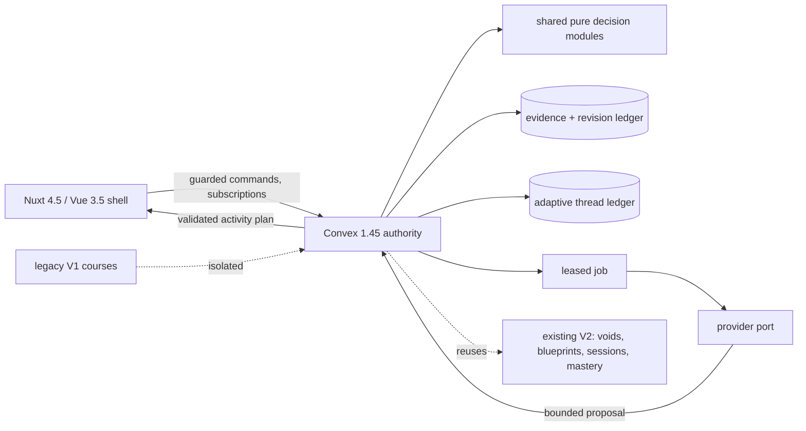
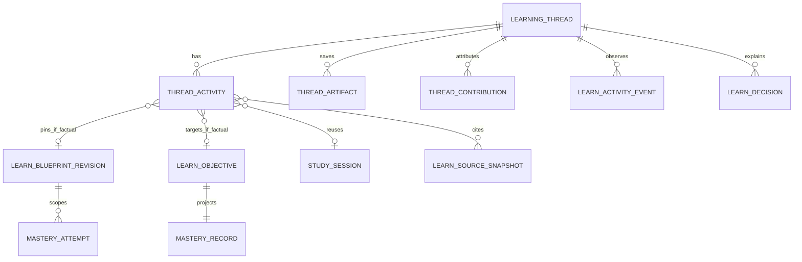
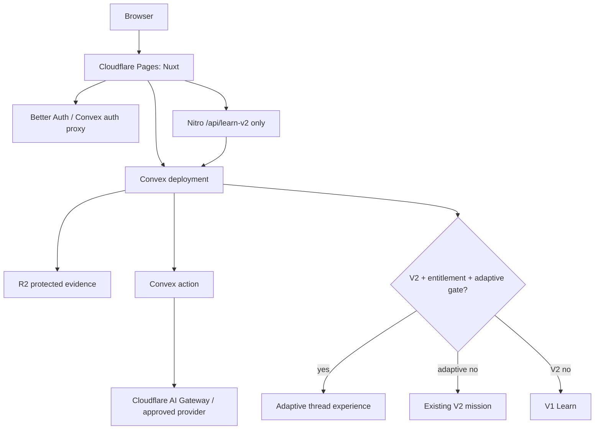

# Budds Adaptive Learn Architecture Spine

## Scope

This spine implements the approved adaptive experience plan without replacing
the existing V1 course or V2 Learning Void data planes. It fixes the invariant
decisions shared by Phase 0–5 work; existing code remains the source of truth
for implementation detail.

## Paradigm

**Server-authoritative adaptive-thread orchestration.** Nuxt/Vue renders a
stable shell and server-validated activity state. Convex owns protected state,
transitions, receipts, and projections. Pure shared modules compute replayable
decisions. Provider ports only propose bounded data; a Convex command accepts
or rejects it.

## Architecture Decisions

### AD-1 — Authority and mutation boundary `[ADOPTED]`

**Binds:** every adaptive read/write, score, lifecycle change, job admission,
and recovery path.

**Prevents:** clients, Nitro handlers, Workers, or providers authoring scores,
mastery, evidence acceptance, access, or lifecycle state.

**Rule:** derive identity in every Convex transaction. Convex commits authority;
Nuxt/Nitro/Workers and provider adapters may perform approved I/O and then call
a guarded command. Keep deterministic routing, validation, scheduling, and
mastery transition evaluation in `shared/` modules. All commands use expected
target revision plus idempotency receipt. `learningThreads` has `revision`; an
activity has immutable `planRevision` and mutable `responseRevision`; every
mutable adaptive command supplies that target revision and a user-scoped key.
`learnActivityCommandReceipts(userId, idempotencyKeyHash)` persists command,
target IDs, fingerprint, and authoritative response before a retry can pass
CAS. Activity-plan replacement creates a new boundary. Jobs use lease,
checkpoint, bounded retries, and terminal reason.

### AD-2 — Additive coexistence `[ADOPTED]`

**Binds:** all adaptive schema, routes, migration, deletion, export, and UI
work.

**Prevents:** V1/V2 dual writes, inferred evidence/mastery/schedules, or a
rollback that corrupts a legacy course.

**Rule:** create an additive adaptive-thread plane which references immutable
V2 mission/session/evidence identities in Phase 1. V1 `courses` and V2
`learningVoids` remain independent. Upgrade is copy-only and never infers
mastery, accepted sources, blueprint acceptance, or schedules. A later thread
aggregate never becomes a replacement for V1/V2 identifiers.

### AD-3 — Explicit revision and mastery scope

**Binds:** active blueprint selection, activity eligibility, attempts,
mastery, scoring, resume, and historical replay.

**Prevents:** newest-ordinal reads masquerading as active state; a score or
mastery record crossing blueprint/objective revisions.

**Rule:** resolve `learningVoids.activeBlueprintRevisionId` where current
authority is required; reject a missing, foreign, superseded, or revision-stale
pointer. Every activity and attempt pins `blueprintRevisionId`, `objectiveId`,
content revision, rubric/scorer/verifier/provider versions, and accepted source
snapshot IDs. `masteryAttempts.blueprintRevisionId` and
`masteryRecords.blueprintRevisionId` are required for adaptive/V2 writes.
`masteryRecords` have exactly one owner+blueprint-revision+objective projection
under the deterministic identity and transaction protocol in AD-14. All current
projections use that scope; legacy-unscoped rows are explicitly read-only.
Attempts are append-only. Encode the permitted state table in one pure module;
only an auditable failed delayed check may regress `retained`.

### AD-4 — Semantic Adaptive Canvas

**Binds:** activity plans, canvas renderer, provider output, fallback, and
accessibility.

**Prevents:** arbitrary generated UI/code, direct generated mutations/tools,
or rendering changes that lose a learner response.

**Rule:** persist a versioned semantic `activityPlan` and decision inputs
separately from rendering. The registry is a discriminated allowlist of
`cited_explanation`, `diagnostic_prompt`, `worked_example`,
`independent_application`, `source_comparison`, `artifact_workspace`, and
`reflection_next_move`. Each primitive has strict bounded props, identity,
reason code, required action, evaluation contract, evidence/claim references,
accessibility metadata, and deterministic text/card fallback. Composition
changes only at an activity boundary. Generated/retrieved/learner text is
untrusted data, never markup or executable instruction. A factual activity
either references immutable published `sessionContentId` plus its existing
`sessionContentClaims`/`learnClaimSupports`, or uses additive
`learnActivityClaims` and supports with the same verifier and
evidence-invalidated contract; no third claim representation is allowed.

### AD-5 — Thread lifecycle is learner-facing, V2 references are authority

**Binds:** intent composer, first-value flow, resume, memory controls,
artifact/history, and future cross-feature contribution.

**Prevents:** a mandatory V2 wizard, irreversible intent switching, and
duplicate mastery/evidence authority.

**Rule:** `learningThread` is the learner-facing aggregate with mutable intent
(`understand`, `prepare`, `build`, `master`, `refresh`, `explore`), outcome,
source state, unresolved point, next-action projection, and lifecycle. An
activity declares `activityClass: factual | non_factual`; V2
`blueprintRevisionId`/`objectiveId` are required only for factual or
mastery-affecting activity. A non-factual diagnostic/goal-shaping activity has
neither claim support nor mastery attempt. Standalone threads may not dispatch
provider work until they explicitly create a V2 reference (otherwise a later,
separate adaptive job type must be introduced). Save artifacts and
representative performances as normalized children. A direct answer never
implies mastery.

### AD-6 — Evidence and feedback integrity `[ADOPTED]`

**Binds:** teaching claims, source drawer, feedback, misconception tags, and
source invalidation.

**Prevents:** model-memory teaching, snippets as evidence, deleted-source
claims, unsupported grading rationales, and private source leakage.

**Rule:** factual activity content cites accepted, unpurged source snapshots
and claim support. Rights/conflict/deletion state gates eligibility. Feedback
uses verifier-approved or safely templated rationales and a controlled
misconception taxonomy. Keep private locators, protected excerpts, credentials,
and raw learner responses out of public views and telemetry. Source deletion
marks affected evidence unavailable while retaining the attempt ledger.

### AD-7 — Routing and measurement are pure, versioned, and non-authoritative

**Binds:** next activity, Why-this explanation, learner overrides, experiments,
event capture, pilot metrics, and replay.

**Prevents:** opaque model choices, clicks/time/confidence raising mastery, or
metrics whose denominator changes silently.

**Rule:** a pure router receives only versioned, pinned intent, eligible
evidence, response outcome, assistance, confidence calibration, available
time, and source state. It emits one recommended next action plus reason and
override options. Each decision persists a canonical, bounded `inputSnapshot`
(intent revision; source snapshot IDs, effective statuses, and record
revisions; prior activity/attempt IDs and outcomes; assistance, confidence,
available time; and router version) plus `inputDigest = sha256(canonical
inputSnapshot)`. Replay consumes the snapshot, never current thread state.
Append semantic events (`thread_drafted`, evidence readiness,
activity eligible/started/submitted/completed, assistance, representative
pass/fail, delayed eligibility/attempt, retained/remediation, provider
failure/ambiguity, evidence invalidation, abandonment/end) with taxonomy and
metric-definition version. Observational signals never change mastery.

### AD-8 — Gates and reversible rollout `[ADOPTED]`

**Binds:** navigation, API/Convex access, cohort admission, experiment, and
rollback.

**Prevents:** client-only gating, adaptive UI exposure after V2 rollback, and
data loss during a cohort rollback.

**Rule:** add `users.learnAdaptiveExperienceEntitlement:{enabled,updatedAt}` and
`hasAdaptiveExperienceAccess = hasLearnV2Access && adaptive entitlement.enabled`.
Every adaptive query, mutation, action, job-admission command, and
`/api/learn-v2` adaptive route uses that function; V2 non-adaptive APIs keep
the existing access function. Adaptive access is default-deny and conjunctive:
authenticated owner plus exact `LEARN_V2_ENABLED === 'true'`, existing V2
entitlement, and adaptive entitlement. Turning adaptive entitlement off denies
adaptive reads/writes/job admission and routes an entitled user to existing V2
mission UI; export/deletion retain their established maintenance authority.
Turning V2 off blocks V2 entry/read/write/job admission. Calendar remains separately gated by
`LEARN_V2_CALENDAR_ENABLED` and explicit V2 re-consent.

### AD-9 — Provider-port containment `[ADOPTED]`

**Binds:** model generation, search, fetch, scoring, content preparation, and
provider failure handling.

**Prevents:** direct external calls in mutations, paid fallback, retrying an
ambiguous external outcome, or provider-owned application behavior.

**Rule:** provider ports have a typed input/output, data-minimization policy,
byte/token/time bounds, policy/version/model/request identifiers, and
sanitized error classes. Existing safe fetch accepts public HTTPS only,
revalidates redirect/DNS targets, blocks private/metadata ranges, enforces MIME
and resource bounds, and forwards no credentials. Search is quota-reserved and
fail-closed. A post-dispatch timeout/outcome becomes `blocked` pending
reconciliation, never an automatic duplicate call.

### AD-10 — Normalized, bounded retention plane `[ADOPTED]`

**Binds:** schema additions, indexes, reads, account/folder/source deletion,
and export.

**Prevents:** unbounded document arrays, table scans, inaccessible retained
data, or a deletion/export hole during rollback.

**Rule:** each new table has `userId`, an owner index, its parent/access index,
and explicit bounded deletion/export traversal. Use normalized children for
events, activities, artifacts, attempts, and decisions; paginate or `.take()`
bounded sets. High-churn events do not patch thread/profile aggregates. Add
deletion/export behavior and test coverage in the same change as schema.

### AD-11 — Stable shell and accessible recovery

**Binds:** Learning Home, thread shell, canvas primitives, responsive layout,
and error/recovery views.

**Prevents:** losing an in-progress response on layout/composition change,
hidden source failure, or inaccessible generated activity.

**Rule:** `/app/learn` is a simple Need / Resume / Worth revisiting / Other
threads home, with coexistence links to legacy V1 and V2 missions. The adaptive
thread route is `/app/learn/thread/:threadId`; existing V2 missions remain
`/app/learn/:learningVoidId`. The thread shell keeps outcome, next action,
canvas, compact history, optional evidence,
path, schedule, and memory controls stable. Preserve keyboard operation,
landmarks, live announcements, focus, reduced motion, non-color state labels,
and touch targets. Panels become drawers on mobile without changing response
state. Preparing/blocked/stale/invalidated provider and evidence states offer
the smallest safe recovery action.

## Structural and Data Shape

Required additive tables are `learningThreads`, `learningThreadActivities`,
`learningThreadArtifacts`, `learnActivityDecisions`, `learnActivityEvents`,
`learnActivityCommandReceipts`, and, before any cross-feature writer,
`learningThreadContributions`; add `learnActivityClaims` only if compact
factual activity cannot reference immutable published V2 session content.
Each uses owner, parent, status/time, and referenced-authority ID indexes as
applicable. `learningThreads` indexes owner+status/updated time; activities
index owner+thread+boundary/time; artifacts index owner+thread+time;
decisions/events index owner+thread+time; receipts uniquely access owner+key;
contributions index owner+thread+time and unique owner+provenance identity.
`learningThreadContributions` stores source feature, source identity/revision,
contribution kind, provenance version, bounded non-content metadata, and
`provenanceKey = sha256(canonicalJson(["learn-thread-contribution.v1",
userId, threadId, sourceFeature, sourceIdentity, sourceRevision,
contributionKind]))`; it never stores raw answers or private source payloads.
Add the mandatory three-part revision-scoped mastery projection
index. Existing V2 rows remain the sole source for blueprint, objective,
evidence, session, attempt, mastery, plan, and provider-job truth.

## Capability → Architecture Map

| Capability | Architecture binding |
|---|---|
| CAP-1 Begin a thread | AD-5, AD-11; Learning Home creates a thread draft from a goal/question and optional owned material without curriculum administration. |
| CAP-2 Source-aware first activity | AD-5, AD-6, AD-11; eligibility selects an immediately useful grounded activity or the smallest safe preparation recovery. |
| CAP-3 Change intent and format | AD-5, AD-7; mutable intent and bounded override produce a new decision without losing history or changing mastery. |
| CAP-4 Stable Adaptive Canvas | AD-4, AD-11; server-validated primitive registry, semantic plan, accessible fallback renderer. |
| CAP-5 Inspect and control evidence | AD-6, AD-9; source drawer and activity eligibility consume accepted, rights-valid V2 evidence only. |
| CAP-6 Resume unresolved point | AD-5, AD-10; normalized thread state restores goal, evidence, attempt context, artifact, and next action. |
| CAP-7 Representative performance/artifact | AD-3, AD-6; completion is an assessed action or persisted output, never page traversal. |
| CAP-8 Optional durable mastery | AD-3, AD-5; only mastery intent activates pinned assessment, spacing, unassisted transfer, delayed review, and retained claims. |
| CAP-9 Provenance-preserving cross-feature memory | AD-5, AD-6, AD-10; adapters append source-attributed contribution records without duplicate attempts or mastery inference. |
| CAP-10 Explain, override, recover | AD-7, AD-9, AD-11; reason code, controls, and bounded recovery preserve accepted state through failure. |
| CAP-11 Coexistence during adoption | AD-2, AD-8; V1/V2 remain usable and flags roll back without loss of their evidence, attempts, plans, mastery, or revisions. |

## Repo-Pinned Seed

| Layer | Binding seed |
|---|---|
| Web shell | Nuxt `^4.5.2`, Vue `^3.5.42`, TypeScript `^5.7.2`; Cloudflare Pages Nitro preset with Node compatibility (`nuxt.config.ts`). |
| Authority | Convex `1.45.0`; Better Auth `1.6.30` / `@convex-dev/better-auth ^0.12.5`; auth uses `tokenIdentifier`. |
| Decisions/tests | shared TypeScript modules; Vitest `^4.1.11`, Playwright `^1.57.0`, `convex-test ^0.0.56`. |
| External boundary | Nitro routes, Convex actions, Cloudflare Workers; Cloudflare AI Gateway/OpenRouter configuration stays server-only. |
| Observability | `@opentelemetry/api ^1.9.1` is available; event payload contracts remain application-owned. |

## Deployment and Rollout

Deployment requires a tested SHA, hosted gate evidence, flag/cohort owner,
provider quota/configuration evidence, keyboard and screen-reader smoke test,
and rollback owner. CI/deterministic adapters prove application behavior only;
they do not prove live provider, Calendar, search, spend, or assistive-tech
activation. Calendar activation has its separate admission gate.

## Implementation-Readiness Contracts

### AD-12 — Canonical adaptive gate

**Binds:** schema, access helper, public status, Nitro wrapper, rollout, and
maintenance paths.

**Prevents:** per-epic flags, client-only authorization, or an adaptive rollback
that changes V2 authority.

**Rule:** add optional `users.learnAdaptiveExperienceEntitlement` exactly as
`{ enabled: boolean, updatedAt: number }`. Only
`internal.learnAdaptiveAccess.setCohortEntitlement` grants/revokes it; it
derives no caller-supplied user identity, rejects account-deletion tombstones,
and records `updatedAt`. `hasAdaptiveExperienceAccess(ctx, tokenIdentifier)`
is the only adaptive guard: exact `LEARN_V2_ENABLED === 'true'` AND existing
`hasLearnV2Access` AND adaptive entitlement. `adaptiveStatus({})` derives
`tokenIdentifier` from Convex auth and exposes only allowed/denied capabilities.
`defineAdaptiveLearnHandler` performs JWT then status before body/provider I/O:
401 unauthenticated, 404 authenticated denied, 503 authority unavailable.
Export, account deletion, source purge, and pending external/R2 cleanup bypass
the access gate under their existing maintenance authority; tombstones deny all
new adaptive work. One matrix test covers absent/malformed flags, entitlement,
tombstone, each Convex function class, wrapper side-effect denial, rollback,
and maintenance exceptions.

### AD-13 — Shared adaptive storage manifest

**Binds:** `convex/schema.ts`, data export, account/folder/source deletion,
object cleanup, and tests.

**Prevents:** a new row/object becoming orphaned, undiscoverable in export, or
missed by a child-before-parent delete.

**Rule:** `shared/adaptive-learn-storage-manifest.ts` is the single table
manifest consumed and assertion-tested by schema, `dataExport`, and
`accountDeletion`. A table enters the manifest in the same earliest story that
introduces its writer: Stories 1.2/1.3 add thread, activity, and receipt
entries; 1.8 adds events; 2.8 adds artifacts; 3.2 adds decisions; and 5.2 adds
`learningThreadContributions` before any contribution writer. For each table
it fixes owner index, parent/access index, bounded export shape/redaction,
deletion phase/order, parent dependencies, and external object cleanup.
Contributions export only source feature, source identity/revision,
contribution kind, provenance version, and bounded metadata; delete them in
the owner/thread child phase before their parent, retain them only until owner
deletion or source purge, and on source purge remove protected fields while
retaining a bounded `source_unavailable` provenance status where historical
audit requires it. Their canonical provenance identity deduplicates retries
without collapsing distinct source origins. `learnActivityClaims` is mandatory only under AD-16. Artifacts store
opaque object references only; delete their R2 objects before local parent
deletion, retrying pending cleanup idempotently. A fixture creates each
row/object and proves bounded export plus no owner-linked row or object after
deletion completes.

### AD-14 — Deterministic mastery projection ownership

**Binds:** mastery migration, schema, transition mutation, projections, and
concurrency tests.

**Prevents:** duplicate records despite a non-unique Convex index, or legacy
unscoped records contaminating adaptive mastery.

**Rule:** canonical adaptive mastery identity is
`scopeKey = sha256(canonicalJson(["learn-v2-mastery-scope.v1", userId,
blueprintRevisionId, objectiveId]))`. During compatibility rollout,
`masteryRecords.scopeKey` remains schema-optional and adds lookup index
`by_userId_and_scopeKey`; every adaptive/current V2 write requires non-null
`blueprintRevisionId` and the matching deterministic key. In the sole
transition mutation: validate ownership/pins, read the scope row with
`.unique()`, return idempotent receipt before mutation, then insert-or-patch
that row in the same Convex transaction. A failed transaction retries the
whole check-then-write transaction; no separate read/write protocol exists.
Legacy null-blueprint/key rows are quarantined: read-only historical export,
excluded from adaptive routing/projections, never backfilled by inference.
Schema validation and a concurrent same-scope command test prove one result.

### AD-15 — Job substrate and provider dispatch

**Binds:** Phase 0/1 activity generation, provider calls, cron recovery,
quota, and future standalone expansion.

**Prevents:** thread-only work being shoehorned into V2 jobs, provider calls
from routes, or provider-specific request semantics.

**Rule:** Phase 0/1 reuse `learnJobs` only for V2-backed factual work, with a
non-null `learningVoidId`, pinned blueprint/session revisions, existing
lease/checkpoint states, and existing V2 cron recovery. Standalone
`non_factual` activity is deterministic and provider-free. A standalone
provider job is deferred until a new `adaptiveLearnJobs` table, manifest entry,
lease/recovery cron, deletion/export path, and explicit AD are approved.

`shared/adaptive-provider-port.ts` is the one provider-neutral request/response
contract: bounded request payload, `provider`, `model`, `policyVersion`,
`requestDigest`, timeout, reservation ID, and reconciliation key in; validated
proposal or `not_dispatched | definitive_failure | ambiguous` out.
`convex/learnAdaptiveActions.ts` is the sole adaptive dispatch owner and calls
the configured Cloudflare AI Gateway/OpenRouter endpoint from the Convex action
runtime. It implements the shared contract directly; it does not import the
Nuxt-only `server/utils/ai-gateway.ts`, which remains the existing Chat adapter.
Nitro routes never dispatch adaptive provider work. Secrets stay runtime-private.
The action reserves quota before dispatch, records dispatch before I/O, and
sends ambiguous outcomes to blocked reconciliation without automatic replay.
Any Slice-1 dispatch additionally requires an approved finite default-deny
pilot manifest. That pilot admission is distinct from the Slice-5 GA activation
manifest and cannot authorize GA cohort expansion.

### AD-16 — Canonical activity provenance and identity

**Binds:** Canvas activities, claims, resume/history, replacement, events,
and source invalidation.

**Prevents:** primitive-specific claim models or event consumers disagreeing on
which activity/plan was observed.

**Rule:** each activity has immutable `activityId`, `boundaryOrdinal`,
`planRevision`, `activityClass`, and optional `replacesActivityId`; replacement
never patches a plan and produces the next boundary. Factual Phase 1 activity
MUST reference immutable published V2 `sessionContentId` and consume its
`sessionContentClaims`/`learnClaimSupports` through one
`shared/adaptive-claim-adapter.ts`. `learnActivityClaims` is not introduced in
Phase 1. If later introduced, it implements that adapter exactly and is added
to AD-13 before any writer lands.

Events use a closed semantic allowlist from AD-7 with `eventVersion`,
`threadId`, optional `activityId`, `occurredAt`, reason/outcome code, and
bounded non-content metadata only. They retain 90 days for operational/product
readout, then purge in 128-row owner-scoped batches; export provides event
metadata but never raw answer/source/provider payload. Decision records retain
the canonical snapshot needed for replay; artifacts follow user deletion/export
controls rather than telemetry TTL.

### AD-17 — Evidence invalidation and maintenance

**Binds:** source deletion, activity eligibility, UI recovery, cached
fallbacks, artifacts, feedback, and cleanup.

**Prevents:** a deleted/purged source continuing to support factual teaching or
feedback, while preserving historical audit truth.

**Rule:** call `internal.learnV2Retention.purgeSourceEvidence` in the same
workflow that removes source access. It purges protected excerpts/private
locators, marks snapshot/claim support evidence unavailable, and emits one
`evidence_invalidated` semantic event per affected activity boundary. A current
or future factual activity with any required support unavailable becomes
`blocked:evidence_invalidated`; its cached fallback is invalidated and UI offers
source review/replacement. Existing attempts, pinned rubric/scorer facts,
non-source-derived learner artifacts, and already-issued feedback remain
historical/read-only but are labelled `evidence_unavailable`; none can produce
new mastery or factual activity. Account/folder deletion owns subsequent R2
cleanup and continues while ordinary access is denied.

### Pilot bounds — activation-configurable caps, default-deny budgets

These are configuration defaults for the pilot, not changes to the evidence,
authority, or isolation invariants above. Raising a cap requires recorded
load/cost evidence; missing or malformed activation configuration resolves to
the stricter/default-deny value.

| Surface | Pilot default |
|---|---|
| Canvas composition | <=7 primitives, <=32 factual claims, <=64 cited source snapshots, one active response per activity boundary |
| Convex read fanout | <=32 thread activities/decisions/events per view; paginated history thereafter; no unbounded collect/filter |
| Payloads | learner response <=12,000 chars; idempotency key <=128 chars; source URL <=2,048 chars; provider/source proposal <=2 MiB wire, <=4 MiB decoded |
| Provider dispatch | 90 s timeout; 5 min lease; <=2 attempts/job; recovery cron every 5 min; ambiguous outcome blocks; no automatic post-dispatch retry |
| Provider admission | scoring <=12 dispatches/user/hour; source fetch <=2 concurrent owner, <=12 owner/minute; search zero-cost only: 800/month product, 25/day product, 4/day user, 2/lifetime/Void |
| SLO/readout | ready evidence/content: first meaningful activity <=90 s for >=70% eligible pilot users; preparation latency separate; alert/review at provider ambiguity >1% of dispatches or any budget denial >5% of eligible starts |

### Repository and deployment truth

Root package declarations are Nuxt `^4.5.2`, Vue `^3.5.42`, TypeScript
`^5.7.2`, Convex `1.45.0`, Better Auth `1.6.30`, Vitest `^4.1.11`, Playwright
`^1.57.0`, and `convex-test ^0.0.56`; reproducible installation is
`pnpm-lock.yaml`, not a caret declaration. Preserve patched
`nuxt-convex@0.0.6` and `@convex-dev/better-auth@0.12.5` patches. Root Pages
production promotion is Cloudflare Pages Git integration after backward-
compatible Convex deployment; `pnpm deploy`/Wrangler `4.128.0` is an approved
manual recovery path only and must not run alongside Git-integrated promotion.
Worker Wrangler/package locks are separate and are not an Adaptive Learn
dependency unless a later approved provider port names them.

## Operational Envelope

| Concern | Enforceable operating rule |
|---|---|
| Latency | Record start→meaningful-activity latency only for ready evidence/content; measure preparation separately. Enforce bounded queries/fanout and provider timeouts. |
| Cost/quota | No implicit paid search/model fallback. Reservations, rate events, and provider policy/model identifiers are durable. |
| Reliability | Pre-dispatch jobs retry within bounds; post-dispatch ambiguity blocks and is reconciled. Idempotency makes client retry safe. |
| Security | Auth derives identity server-side; all source/model/learner text is untrusted; validated primitive props and no provider/client tool bridge. |
| Privacy | Telemetry stores versioned semantic outcome/state, not raw learner answer, source content, private locator, token, or credential. Retention/delete/export are explicit. |
| Accessibility | Every primitive has a deterministic fallback; test keyboard, live region, focus, reduced motion, forced colors, touch and mobile drawers. |
| Performance | Owner/parent indexes plus bounded pagination; no query `filter` or unbounded `.collect()` in new paths; separate high-churn event rows. |

## Verification Contract

Phase 0 must add tests for active-pointer resolution; revision-scoped attempts
and mastery; full monotonic transition table including auditable retained
regression; no client score/verdict/mastery authority; scorer/rubric/verifier
pins; controlled feedback; Canvas schema rejection/fallback; V1/V2 isolation;
and deterministic delayed-retention clock/DST cases.

Phase 1–5 tests must cover ready/preparing/blocked/stale/invalidated activity,
assisted pass, failed remediation, independent and delayed retained pass,
provider timeout before/after commit, adaptive rollback without loss, and
accessibility fallback. Run `pnpm verify:learn-v2-beta` for the focused
non-Calendar gate and `pnpm verify` before merge; retain live activation
evidence separately.

## Deferred

## Implementation contract handoff

The story-level route, schema, Convex function, provider-port, claim-adapter,
component, fixture, duplicate-tab, and navigation contracts are canonical in
`_bmad-output/planning-artifacts/implementation-contracts.md`. In particular,
the adaptive route is the static Nuxt page
`app/pages/app/learn/thread/[threadId].vue`; the existing
`app/pages/app/learn/[learningVoidId]/index.vue` remains the V2 mission route.
No implementation may introduce a second adaptive route, provider adapter, or
claim projection. Slice 0 owns the shared storage manifest and first-value
metric denominator/query; Epic 6 may only extend operational readouts.

- The seven later candidate primitives (concept map, timeline, rehearsal,
  retrieval burst, audio conversation, decision tree, sandbox) follow the
  Phase-0 registry contract; they are not required to establish it.
- Cross-feature contribution adapters for Chat, Quiz, Flashcards, Podcast, and
  Documents wait until the thread first-value pilot proves utility; they may
  only append provenance-preserving events/activities under AD-5 through AD-7.
- Calendar-driven thread scheduling waits on its existing separate Calendar
  activation evidence; adaptive learning neither requires nor weakens it.
